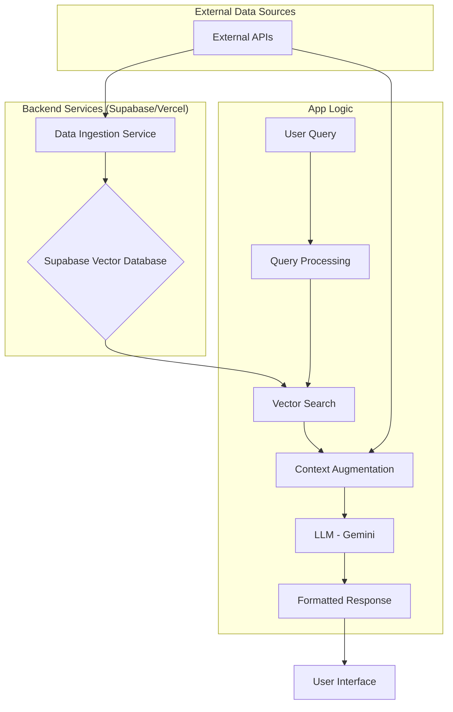

# 🧠 Local Knowledge RAG - Implementation Plan

## 1. 🎯 Feature Overview

The "Local Knowledge RAG" (Retrieval-Augmented Generation) feature will provide users with hyper-local, real-time information about their surroundings. It will act as a local expert, surfacing hidden gems, daily updates, and insider tips that go beyond standard mapping services.

### Core User Value:
- **Discover Uniqueness**: Find local secrets, seasonal events, and unique spots.
- **Stay Updated**: Get real-time info on pop-ups, construction, and community events.
- **Gain Insider Knowledge**: Access tips like free parking, best photo times, and local etiquette.

## 2. 🏛️ System Architecture

We will implement a multi-layered RAG architecture that combines several data sources, processes them, and serves them to the user through a conversational interface.

### Architecture Diagram



### Component Breakdown:
1.  **External APIs**: We will integrate multiple free and high-volume APIs to gather a rich dataset.
2.  **Data Ingestion Service**: A serverless function (run daily/hourly) to fetch, clean, and embed data from external APIs into our vector database.
3.  **Supabase Vector Database**: We'll use `pgvector` on Supabase to store embeddings of local knowledge.
4.  **Query Processing**: User's natural language query is processed and converted into an embedding.
5.  **Vector Search**: The user's query embedding is used to find the most relevant documents (local tips) from the database.
6.  **Context Augmentation**: The retrieved documents are combined with real-time data fetched directly from APIs (e.g., current weather, live event status).
7.  **LLM (Gemini)**: The augmented context and the original query are sent to a powerful language model like Google's Gemini to generate a coherent, human-like response.
8.  **User Interface**: The response is displayed in a conversational format within the app.

## 3. 🛠️ API Selection & Integration Strategy

We have a wealth of free-tier APIs available. We will prioritize them based on the quality and type of data they provide.

### Primary APIs:
-   **Google Places API**: (1000 requests/month free)
    -   **Use Case**: Core business info, reviews, photos, place details.
    -   **Integration**: `services/GooglePlacesService.ts`. Will require an API key setup in `.env`.
-   **OpenStreetMap (Overpass API)**: (Completely free, unlimited)
    -   **Use Case**: Hyper-detailed map data, including community-sourced points of interest (parks, benches, hiking trails, street art). The true source of "hidden gems".
    -   **Integration**: `services/OpenStreetMapService.ts`.

### Secondary & Event-Based APIs:
-   **Foursquare Places API**: (100,000 calls/month free)
    -   **Use Case**: User-generated tips, social check-ins, venue details. Excellent for "insider tips".
    -   **Integration**: `services/FoursquareService.ts`.
-   **Eventbrite API**: (Free for public events)
    -   **Use Case**: Finding local workshops, concerts, festivals, and community gatherings.
    -   **Integration**: `services/EventbriteService.ts`.

### API Integration Plan:
1.  Create a new `services/` directory for each API.
2.  Develop a standard interface `ILocalDataService` for fetching data to ensure consistency.
3.  Add API keys to environment variables and update `.env.template`.
4.  Implement robust error handling and rate-limiting wrappers for each service.

## 4. 📄 Data Modeling

### Supabase `local_knowledge` Table:
We need a table to store the vectorized information.

```sql
CREATE TABLE local_knowledge (
    id UUID PRIMARY KEY DEFAULT gen_random_uuid(),
    source TEXT NOT NULL, -- e.g., 'foursquare_tips', 'osm_notes'
    content TEXT NOT NULL, -- The actual text tip or description
    location GEOGRAPHY(Point, 4326), -- Geographic coordinates
    metadata JSONB, -- Store extra info like hours, ratings, event_times
    embedding VECTOR(1536), -- Using text-embedding-ada-002 or similar
    created_at TIMESTAMPTZ DEFAULT NOW(),
    updated_at TIMESTAMPTZ DEFAULT NOW()
);

-- Create a spatial index for fast location-based lookups
CREATE INDEX ON local_knowledge USING GIST (location);

-- Function to update the updated_at column
CREATE OR REPLACE FUNCTION set_updated_at()
RETURNS TRIGGER AS $$
BEGIN
    NEW.updated_at = NOW();
    RETURN NEW;
END;
$$ LANGUAGE plpgsql;

CREATE TRIGGER set_updated_at_trigger
BEFORE UPDATE ON local_knowledge
FOR EACH ROW
EXECUTE FUNCTION set_updated_at();
```

## 5. 🚀 Step-by-Step Implementation Plan

### Phase 1: Backend & Data Layer (3-4 days)
1.  **[DB]** Create the `local_knowledge` table in Supabase using the schema above.
2.  **[API]** Set up the Google Places API and OpenStreetMap Overpass API integrations. Create `services/GooglePlacesService.ts` and `services/OpenStreetMapService.ts`.
3.  **[API]** Securely store API keys in environment variables and update documentation.
4.  **[Service]** Develop the initial data ingestion service. This will be a Supabase Edge Function that runs on a schedule.
    -   It will fetch data for a specific area (e.g., San Francisco).
    -   Generate embeddings for the fetched content.
    -   Store the data in the `local_knowledge` table.
5.  **[Test]** Manually trigger the ingestion service and verify that data is being populated correctly in the database.

### Phase 2: Core RAG Pipeline (2-3 days)
1.  **[Service]** Create a new Supabase Edge Function: `queryLocalKnowledge`.
2.  **[Function]** This function will take a user query (text) and location (lat/lng).
3.  **[Function]** It will generate an embedding for the user's query.
4.  **[Function]** Perform a vector similarity search on the `local_knowledge` table, filtered by location proximity.
5.  **[Function]** Retrieve the top 5-10 most relevant documents (tips).
6.  **[LLM]** Pass the retrieved documents and the original query to a Gemini/OpenAI model with a carefully crafted prompt to generate a helpful response.
7.  **[Test]** Test the function with various queries like "Where can I find free parking near Golden Gate Park?" or "Any cool pop-up events happening today?".

### Phase 3: UI/UX Integration (2-3 days)
1.  **[UI]** Design a new "Local Expert" or "Discover" chat interface in the app.
2.  **[Component]** Create a `LocalKnowledgeChat` component.
3.  **[State]** Manage conversation state using a slice in your state management solution (e.g., Redux Toolkit).
4.  **[Integration]** Connect the UI to the `queryLocalKnowledge` backend function.
5.  **[UI]** Implement a clean, conversational UI to display messages, including loading states and error messages.
6.  **[Test]** Thoroughly test the user flow from query to response.

### Phase 4: Expansion & Refinement (Ongoing)
1.  **[API]** Integrate Foursquare and Eventbrite APIs to enrich the dataset.
2.  **[Service]** Enhance the ingestion service to handle more data sources and perform data cleaning.
3.  **[LLM]** Refine the LLM prompt to improve response quality.
4.  **[Cache]** Implement caching for common queries to reduce latency and API costs.
5.  **[Feedback]** Add a user feedback mechanism (thumbs up/down) to help us evaluate and improve response quality.

## 6. 🔐 Security & Cost Management
- **API Keys**: All keys will be stored securely in environment variables and never exposed on the client-side.
- **Rate Limiting**: Implement wrappers for API services to handle rate limits gracefully.
- **Cost Monitoring**: Set up billing alerts on Google Cloud Platform and other services. We will rely heavily on the generous free tiers.
- **Data Privacy**: Ensure that no personally identifiable user data is sent to external services, only anonymized queries and locations.

"That's what she said." - Michael Scott 